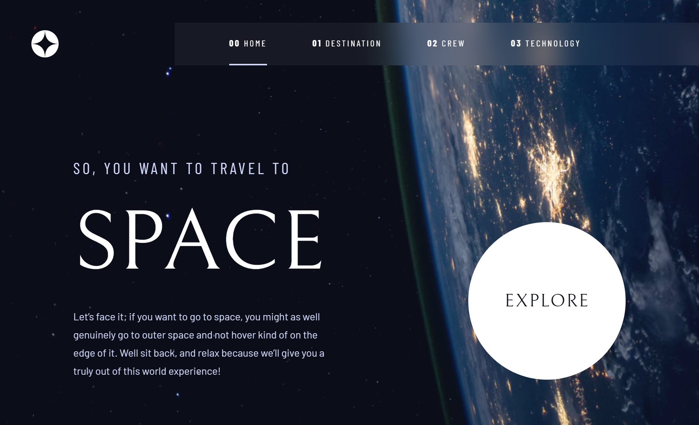

# Frontend Mentor - Space tourism website solution

This is a solution to the [Space tourism website challenge on Frontend Mentor](https://www.frontendmentor.io/challenges/space-tourism-multipage-website-gRWj1URZ3).

## Table of contents

- [Overview](#overview)
  - [The challenge](#the-challenge)
  - [Screenshot](#screenshot)
  - [Links](#links)
- [My process](#my-process)
  - [Built with](#built-with)
  - [What I learned](#what-i-learned)
  - [Useful resources](#useful-resources)
- [Author](#author)

## Overview

### The challenge

Users should be able to:

- View the optimal layout for each of the website's pages depending on their device's screen size
- See hover states for all interactive elements on the page
- View each page and be able to toggle between the tabs to see new information

### Screenshot

### Links

- Solution URL: [https://github.com/notanut/space-tourism-website](https://github.com/notanut/space-tourism-website)
- Live Site URL: [https://space-tourism-website-ruddy.vercel.app/](https://space-tourism-website-ruddy.vercel.app/)

## My process

### Built with

- Semantic HTML5 markup
- CSS custom properties
- CSS Grid
- JQuery

### What I learned

This is the first time I use while learn JQuery. It was a lot of fun!

### Useful resources

- [Scrimba](https://scrimba.com/learn/spacetravel) - The course from Kevin Powell helped me a lot when I got stuck.

## Author

- Website - [Natasya](https://project-portofolio.netlify.app/)
- Frontend Mentor - [@notanut](https://www.frontendmentor.io/profile/notanut)
